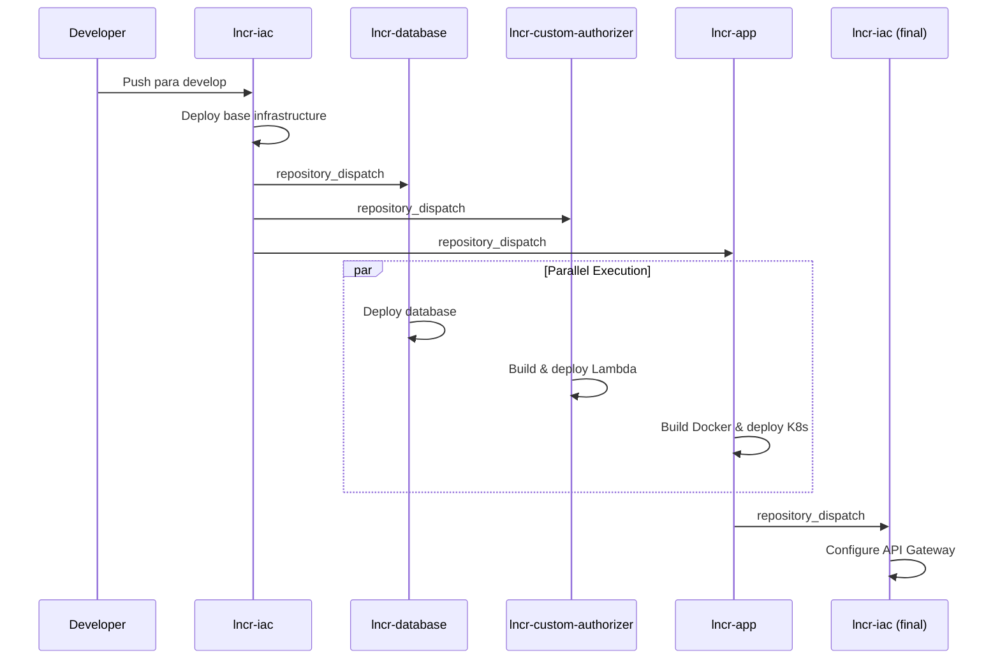

# Tech Challenge Fase 3 - 11 SOAT

## Participantes

- **Gustavo Silva** (361477)
- **Tito Parizotto** (361184)

## Vídeo de Demonstração

[Em breve - Link do vídeo de demonstração será adicionado aqui]

## Entregáveis

### Repositórios

- **Repositório Infra-as-Code** - [lncr-iac](https://github.com/11soat-f3-lanches-caieiras/lncr-iac)  
- **Repositório de Banco de Dados** -[ lncr-database](https://github.com/11soat-f3-lanches-caieiras/lncr-database)  
- **Repositório de Function** - [lncr-custom-authorizer  ](https://github.com/11soat-f3-lanches-caieiras/lncr-custom-authorizer)
- **Repositório Aplicação** - [lncr-app](https://github.com/11soat-f3-lanches-caieiras/https://github.com/11soat-f3-lanches-caieiras/lncr-app)
- **Repositório Core** - [lncr-core](https://github.com/11soat-f3-lanches-caieiras/lncr-core)  

### Implementação do API Gateway + Autenticação e JWT

#### Gateway via Pipeline + Terraform (lncr-iac)

A implementação do API Gateway foi realizada através do módulo Terraform localizado no repositório [lncr-iac](https://github.com/11soat-f3-lanches-caieiras/lncr-iac). O processo de deploy é automatizado através de GitHub Actions com o workflow `infra-complete.yml` que:

- **Integração com EKS**: O pipeline obtém automaticamente o ARN do Network Load Balancer (NLB) do cluster EKS para configurar a integração
- **Configuração Lambda**: Recupera o ARN da função Lambda custom authorizer para configuração da autenticação
- **Deploy Automatizado**: Utiliza Terraform para aplicar as configurações do módulo `api_gateway` com os parâmetros obtidos dinamicamente
- **Integração com NLB**: Configura a conexão entre o API Gateway e o NLB do EKS para roteamento das requisições

```yaml
# Exemplo do processo no workflow
- name: Deploy API Gateway Configuration with NLB
  run: |
    terraform apply \
      -target=module.api_gateway \
      -var="eks_nlb_listener_arn=${{ env.NLB_LISTENER_ARN }}" \
      -var="lambda_function_arn=${{ env.FUNCTION_ARN }}" \
      -var-file="prd.tfvars" \
      -auto-approve
```

#### Validação Lambda (lncr-custom-authorizer)

A validação de autenticação é implementada através de uma AWS Lambda Function desenvolvida em Java, localizada no repositório [lncr-custom-authorizer](https://github.com/11soat-f3-lanches-caieiras/lncr-custom-authorizer):

- **Custom Authorizer**: Função Lambda que atua como custom authorizer do API Gateway
- **Validação JWT**: Implementa a lógica de validação de tokens JWT recebidos nas requisições
- **Controle de Acesso**: Utiliza arquivo de configuração `allow-paths-rules.yaml` para definir regras de acesso
- **Build Automatizado**: Projeto Maven com empacotamento em JAR para deploy na AWS Lambda
- **Estrutura Java**: Implementação em `br.com.tp.lncr` seguindo padrões de desenvolvimento enterprise

#### Solicitação de Token JWT (lncr-app)

A aplicação principal implementa o endpoint para solicitação de tokens JWT através do módulo OAuth, localizado no repositório [lncr-app](https://github.com/11soat-f3-lanches-caieiras/lncr-app):

- **Controller OAuth**: Implementação em `OauthRestController.java` e `OauthRestControllerImpl.java`
- **Geração de Tokens**: Endpoint responsável por gerar tokens JWT válidos para autenticação
- **Integração com API Gateway**: Os tokens gerados são utilizados para autenticação nas chamadas através do API Gateway
- **Estrutura REST**: Segue padrões REST para exposição dos endpoints de autenticação

A arquitetura completa garante que:
1. O API Gateway recebe requisições externas
2. O Custom Authorizer valida os tokens JWT
3. Requisições válidas são roteadas para a aplicação via NLB/EKS
4. A aplicação fornece endpoints para obtenção de novos tokens JWT

### Deploy Automatizado

#### Proteção de Branch Master

Todos os repositórios do projeto implementam proteção da branch `master` através de:

- **Aprovação Manual**: Workflows configurados com aprovação manual obrigatória através do `trstringer/manual-approval@v1`
- **Approvers Definidos**: Aprovação restrita aos usuários `gustavo-log` e `titoparizotto`
- **Mínimo de Aprovações**: Configurado para requerer pelo menos 1 aprovação antes do deploy
- **Ambientes Protegidos**: Utilização de environments do GitHub (`prd` e `dev`) para controle adicional de acesso

#### Gerenciamento de Secrets

O projeto utiliza uma estratégia dupla para gerenciamento de credenciais e configurações sensíveis:

**AWS Secrets Manager:**
- Armazenamento seguro de chaves JWT e configurações de infraestrutura
- Rotação automática de credenciais
- Integração nativa com serviços AWS (Lambda, EKS)
- Exemplo: `LNCR_AWS_SECRET_NAME` para chaves de validação JWT

**GitHub Secrets:**
- Credenciais de acesso para pipelines (AWS, Docker Hub, Maven)
- Tokens de integração entre repositórios (`REPO_TOKEN`)
- Configurações específicas de build e deploy

**Aplicação lncr-app - Uso Intensivo de Secrets:**

A aplicação utiliza uma ampla gama de secrets para diferentes integrações:

```yaml
# OAuth Configuration
LNCR_OAUTH_ADMIN_CLIENT_ID/SECRET
LNCR_OAUTH_MONITOR_CLIENT_ID/SECRET  
LNCR_OAUTH_TOTEM_CLIENT_ID/SECRET
LNCR_OAUTH_SECRET_KEY

# Payment Integration
MERCADOPAGO_CLIENT_ID/SECRET_ID/POS_ID

# Database Connection
POSTGRES_URL/USER/PASSWORD

# Build & Registry
LNCR_MAVEN_ACTOR/PAT
DOCKER_USERNAME/PASSWORD
```

Os secrets são injetados tanto nas variáveis de ambiente do container quanto nos secrets do Kubernetes através do Helm.

#### Pipelines e Orquestração

**1. Pipeline de Infraestrutura Base (lncr-iac)**

```yaml
# Workflow: infra-base.yml
Trigger: Push na branch develop
Componentes: VPC, EKS, ECR, Secrets Manager, FSx, OpenVPN, Lambda
Tecnologia: Terraform + GitHub Actions
Saída: Dispara outros repositórios via repository_dispatch
```

**2. Pipeline de Banco de Dados (lncr-database)**

```yaml
# Workflow: deploy-database.yml
Trigger: repository_dispatch do lncr-iac
Componentes: RDS PostgreSQL, estrutura de dados
Tecnologia: Terraform + SQL scripts
Aprovação: Manual antes do deploy
Verificação: Conectividade e estrutura pós-deploy
```

**3. Pipeline de Autorização (lncr-custom-authorizer)**

```yaml
# Workflow: lncr-customer-authorizer-build-deploy.yaml
Trigger: repository_dispatch do lncr-iac
Build: Maven + Java 21
Deploy: AWS Lambda Function
Artifacts: JAR com hash do commit
Secrets: Criação/atualização no AWS Secrets Manager
```

**4. Pipeline de Aplicação (lncr-app)**

```yaml
# Workflow: lncr-app-build-deploy.yaml
Trigger: repository_dispatch do lncr-iac
Build: Docker + Maven
Registry: Amazon ECR
Deploy: Kubernetes via Helm
Tecnologias: Docker, Kubernetes, Helm Charts
Aprovação: Manual antes do deploy
Saída: Dispara lncr-iac para configuração final
```

**5. Pipeline de Infraestrutura Completa (lncr-iac)**

```yaml
# Workflow: infra-complete.yml
Trigger: repository_dispatch do lncr-app
Componentes: API Gateway + integração NLB
Dependências: ARN do NLB (EKS) + ARN da Lambda
Tecnologia: Terraform
```

#### Fluxo de Encadeamento de Execuções



#### Tecnologias Utilizadas

**Terraform:**
- Infraestrutura como código para todos os recursos AWS
- Módulos reutilizáveis para cada componente
- State management centralizado
- Targeting específico para deploy incremental

**Docker:**
- Containerização da aplicação Java
- Multi-stage builds com Maven
- Push automático para Amazon ECR
- Versionamento com hash do commit

**Kubernetes:**
- Orquestração de containers no Amazon EKS
- Network Load Balancer para exposição de serviços
- Secrets management integrado
- Auto-scaling e service discovery

**Helm:**
- Templating e versionamento de deployments
- Configuração parametrizada via values
- Rollback automático em caso de falhas
- Integração com secrets do Kubernetes

O pipeline completo garante deploy seguro, rastreável e automatizado de toda a infraestrutura e aplicação, com aprovações manuais em pontos críticos e rollback automático em caso de problemas.
